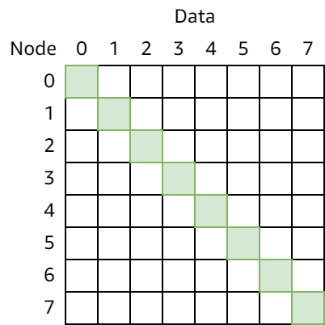
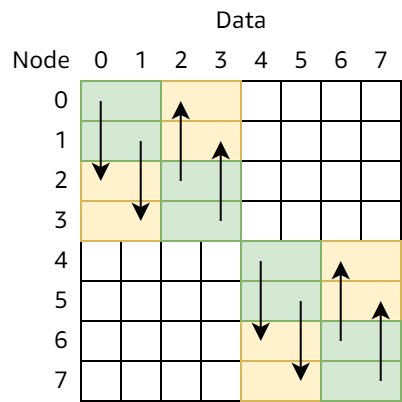
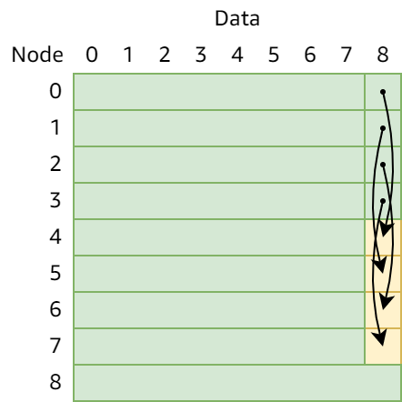

# 并行程序设计 实验报告

## 实验环境

除实验 2.4 以外的所有实验题目均在以下“基准环境”中测试。

- CPU：AMD Ryzen 9 3900X 12-Core Processor（12 核心，24 线程，基准频率 3.8 GHz）
- 内存：128 GB DDR4 2666 MHz
- 操作系统：Ubuntu 20.04.3 LTS
- 编译器：GCC 9.3.0
- OpenMP 运行环境：GCC OpenMP 10.3.0
- MPI 运行环境：MPICH 3.3.2

所有实验中，MPI 实现的“处理器数量”通过修改 `mpirun -np` 的参数来调整，OpenMP 实现的“处理器数量”通过指定环境变量 `OMP_NUM_THREADS` 来调整。

- 为了避免编译器对“原始代码”进行过度优化而影响手动优化代码的效率，实验 1.x 使用的编译参数为 `-O2 -Wall -Wno-unused-result`；
- 为了尽可能提升代码运行效率，实验 2.x 使用的编译参数为 `-O3 -Wall -Wno-unused-result -march=native -fopenmp`。

所有实验中，运行时间都是多次运行的结果取平均值，单位都是秒（s）。

## 1.1 二叉树与蝶式求全和

本实验实现在 N 个处理器上计算 N 个数的和，并且最终每个处理器都获得所有数的全和。为了方便起见，假设 N 是 2 的幂次。

### 二叉树求和

二叉树算法分为两个阶段：

- 第一阶段按照二叉树的结构，在树的同一层的两个相邻节点间求和，直到 0 号处理器作为树根算出全和；
- 第二阶段按照二叉树的结构，自“顶”向下向每个处理器传输计算结果。

实现思路：

1. 每个处理器具有一个编号。由于处理器总数 N 是 2 的幂次，每个处理器的编号在二进制下的值为 000…0 到 111…1，不重不漏。
2. 在第一阶段的第 i 步（i 从 0 开始），编号为 2^i^ 的整数倍（低 i 位全为零）的处理器传输数据，由第 i 位为 1 的处理器发至对应的第 i 位为 0 的处理器，后者将自己的数与收到的数相加。
3. 在第二阶段的第 i 步，编号为 2^L-i-1^ 的整数倍的处理器传输结果，过程与第一阶段类似。

#### MPI 实现

在 MPI 实现中，0 号进程负责读取并分发数据。第一阶段传输数据并相加，为了方便使用位运算，此处的变量 `i` 为上方思路中 2^i^ 的值。

```c
// Binary-tree gather & reduce
for (int i = 1; i < size; i <<= 1) {
    if ((rank & (i - 1)) != 0)
        continue;
    if ((rank & i) == 0) {
        int value;
        MPI_Recv(&value, 1, MPI_INT, rank ^ i, 0, MPI_COMM_WORLD, MPI_STATUS_IGNORE);
        sum += value;
    } else {
        MPI_Send(&sum, 1, MPI_INT, rank ^ i, 0, MPI_COMM_WORLD);
    }
}
```

第二阶段反向运行，广播结果：

```c
// Binary-tree broadcast
for (int i = size >> 1; i > 0; i >>= 1) {
    if ((rank & (i - 1)) != 0)
        continue;
    if ((rank & i) == 0) {
        MPI_Send(&sum, 1, MPI_INT, rank ^ i, 0, MPI_COMM_WORLD);
    } else {
        MPI_Recv(&sum, 1, MPI_INT, rank ^ i, 0, MPI_COMM_WORLD, MPI_STATUS_IGNORE);
    }
}
```

运行结果：

| 进程数 | 运行时间 | 加速比 |
| ------ | -------- | ------ |
| 1      | 0.000000 | 1      |
| 2      | 0.000003 | 0      |
| 4      | 0.000005 | 0      |
| 8      | 0.000010 | 0      |
| 16     | 0.000021 | 0      |

#### OpenMP 实现

由于 OpenMP 使用共享内存模型，因此在 OpenMP 实现中无需使用（也没有）“发送/接收”语义，直接将对应的数值相加即可。核心代码如下：

```c
// Reduce sum
for (int i = 1; i < n; i <<= 1) {
    #pragma omp parallel for schedule(static, 1)
    for (int j = 0; j < n; j += i << 1) {
        A[j] += A[j + i];
    }
}

// Broadcast
for (int i = n >> 1; i > 0; i >>= 1) {
    #pragma omp parallel for schedule(static, 1)
    for (int j = 0; j < n; j += i << 1) {
        A[j + i] = A[j];
    }
}
```

运行结果：

| 线程数 | 运行时间 | 加速比 |
| ------ | -------- | ------ |
| 1      | 0.000005 | 1      |
| 2      | 0.000078 | 0.06   |
| 4      | 0.000120 | 0.04   |
| 8      | 0.000193 | 0.03   |
| 16     | 0.000385 | 0.01   |

### 蝶式求和

蝶式求和与二叉树求和非常相似，主要区别是在二叉树的每一层中，不再只有“这一层的两个局部根节点”参与运算，而是所有节点都与“自己在本层中对应的节点”通信并运算，从实现上看，发送与接收不再有单向性，且删去了“局部根节点”的检查。

#### MPI 实现

使用 `MPI_Sendrecv`，核心代码非常的简单：

```c
// Butterfly exchange & add
for (int i = 1; i < size; i <<= 1) {
    int value;
    MPI_Sendrecv(&sum, 1, MPI_INT, rank ^ i, 0, &value, 1, MPI_INT, rank ^ i, 0, MPI_COMM_WORLD, MPI_STATUS_IGNORE);
    sum += value;
}
```

运行结果：

| 进程数 | 运行时间 | 加速比 |
| ------ | -------- | ------ |
| 1      | 0.000000 | 1      |
| 2      | 0.000005 | 0      |
| 4      | 0.000007 | 0      |
| 8      | 0.000019 | 0      |
| 16     | 0.000035 | 0      |

#### OpenMP

与二叉树求和不同的是，由于两边同时进行“交换数据并相加”的结果，此次的 OpenMP 实现不得不使用双缓冲的方案来避免数据竞争。核心代码如下：

```c
// Reduce sum
// Unfortunately we have to use two buffers,
// otherwise it's impossible to perform "send/recv and add" without blocking
for (int i = 1; i < n; i <<= 1) {
    #pragma omp parallel for schedule(static, 1)
    for (int j = 0; j < n; j++) {
        B[j] = A[j] + A[j ^ i];
    }
    int *T = A;
    A = B;
    B = T;
}
```

运行结果：

| 线程数 | 运行时间 | 加速比 |
| ------ | -------- | ------ |
| 1      | 0.000005 | 1      |
| 2      | 0.000047 | 0.11   |
| 4      | 0.000097 | 0.05   |
| 8      | 0.000191 | 0.03   |
| 16     | 0.000352 | 0.01   |

## 1.2 作业题目中的相关程序实现

### 1.3.1

将代码向量化：

```vbscript
for I=1 to N do
  A(I) = B(I) + C(I+1)
  C(I) = A(I) * D(I)
end for
```

向量化结果：

```vbscript
A(1:N) = B(1:N) + C(2:N+1)
C(1:N) = A(1:N) * D(1:N)
```

实现代码：

```c
void f_ref(int *a, int *b, int *c, int *d) {
    for (int i = 1; i <= N; i++) {
        a[i] = b[i] + c[i + 1];
        c[i] = a[i] * d[i];
    }
}

void f_vec(int *a, int *b, int *c, int *d) {
#pragma omp simd
    for (int i = 1; i <= N; i++) {
        a[i] = b[i] + c[i + 1];
    }

#pragma omp simd
    for (int i = 1; i <= N; i++) {
        c[i] = a[i] * d[i];
    }
}
```

运行结果：

| 原始代码 | 向量化结果 |
| -------- | ---------- |
| 0.000001 | 0.000001   |

### 3.2.2

将代码向量化和并行化：

```c
for i = 1 to 100 do // 循环 2 N 是常量
  X[i] = Y[i] + 10; // 语句 S1
  for j = 1 to 100 do
    B[j] = A[j, N]; // 语句 S2
    for k = 1 to 100 do 
      A[j+1, k] = B[j] + C[j, k]; // 语句 S3
    endfor // loop-k
    Y[i+j] = A[j+1, N]; // 语句 S4
  endfor // loop-j
endfor // loop-i
```

优化结果：

```vbscript
for j = 1 to 100 do
  B[j] = A[j, N]
  A[j+1, 1:100] = B[j] + C[j, 1:100]
endfor
Y[2:100] = A[2, N]
Y[101:200] = A[2:101, N]
X[1:100] = Y[1:100] + 10
```

实现代码：

```c
void f_ref(int a[][101], int b[], int c[][101], int x[], int y[]) {
    for (int i = 1; i <= 100; i++) {
        x[i] = y[i] + 10;
        for (int j = 1; j <= 100; j++) {
            b[j] = a[j][N];
            for (int k = 1; k <= 100; k++) {
                a[j + 1][k] = b[j] + c[j][k];
            }
            y[i + j] = a[j + 1][N];
        }
    }
}

void f_opt(int a[][101], int b[], int c[][101], int x[], int y[]) {
    for (int j = 1; j <= 100; j++) {
        b[j] = a[j][N];
#pragma omp simd
        for (int i = 1; i <= 100; i++) {
            a[j + 1][i] = b[j] + c[j][i];
        }
    }
#pragma omp simd
    for (int i = 2; i <= 100; i++) {
        y[i] = a[2][N];
    }
#pragma omp simd
    for (int i = 2; i <= 101; i++) {
        y[i + 99] = a[i][N];
    }
#pragma omp simd
    for (int i = 1; i <= 100; i++) {
        x[i] = y[i] + 10;
    }
}
```

运行结果：

| 原始代码 | 优化结果 |
| -------- | -------- |
| 0.000678 | 0.000003 |

### 3.5.1

将代码向量化和并行化：

```c
for i = 1 to 100 do //循环 1 
  A[i] = A[i] + B[i-1]; // S1
  B[i] = C[i-1] * 2 ;  // S2
  C[i] = 1 / B[i] ;    // S3
  D[i] = C[i] * C[i] ; // S4
endfor
```

优化结果：

```vbscript
for i = 1 to 100 do //循环 1 
  B[i] = C[i-1] * 2;
  C[i] = 1 / B[i];
endfor
A[1:100] = A[1:100] + B[0:99]
D[1:100] = C[1:100] * C[1:100]
```

实现代码：

```c
void f_ref(double *a, double *b, double *c, double *d) {
    for (int i = 1; i <= 100; i++) {
        a[i] = a[i] + b[i - 1];
        b[i] = c[i - 1] * 2;
        c[i] = 1 / b[i];
        d[i] = c[i] * c[i];
    }
}

void f_opt(double *a, double *b, double *c, double *d) {
    for (int i = 1; i <= 100; i++) {
        b[i] = c[i - 1] * 2;
        c[i] = 1 / b[i];
    }

#pragma omp simd
    for (int i = 1; i <= 100; i++) {
        a[i] = a[i] + b[i - 1];
    }

#pragma omp simd
    for (int i = 1; i <= 100; i++) {
        d[i] = c[i] * c[i];
    }
}
```

运行结果：

| 原始代码 | 优化结果 |
| -------- | -------- |
| 0.000002 | 0.000001 |

### 3.5.2

将代码向量化和并行化：

```c
for i = 1 to 999 do // 循环 2
  A[i] = B[i] + C[i];                  // S1
  D[i] = ( A[i] + A[ 999-i+1 ] ) / 2 ; // S2
endfor
```

优化结果：

```vbscript
A[1:500] = B[1:500] + C[1:500]
D[1:500] = (A[1:500] + A[999:500]) / 2
A[501:999] = B[501:999] + C[501:999]
D[501:999] = (A[501:999] + A[499:1]) / 2
```

实现代码：

```c
void f_ref(int *a, int *b, int *c, int *d) {
    for (int i = 1; i <= 999; i++) {
        a[i] = b[i] + c[i];
        d[i] = (a[i] + a[999 - i + 1]) / 2;
    }
}

void f_opt(int *a, int *b, int *c, int *d) {
#pragma omp simd
    for (int i = 1; i <= 500; i++) {
        a[i] = b[i] + c[i];
    }
#pragma omp simd
    for (int i = 1; i <= 500; i++) {
        d[i] = (a[i] + a[1000 - i]) / 2;
    }
#pragma omp simd
    for (int i = 501; i <= 999; i++) {
        a[i] = b[i] + c[i];
    }
#pragma omp simd
    for (int i = 501; i <= 999; i++) {
        d[i] = (a[i] + a[1000 - i]) / 2;
    }
}

void init(int *a, int size) {
    for (int i = 0; i < size; i++)
        a[i] = rand();
}
```

运行结果：

| 原始代码 | 优化结果 |
| -------- | -------- |
| 0.000002 | 0.000001 |

### 3.5.3

将代码向量化和并行化：

```c
for i = 1 to 100 do // 循环 3
  for j = 1 to 100 do
    A[3*i+2*j, 2*j] = C[i,j] * 2 ; // S1
    D[i,j] = A[i-j+6, i+j] ;       // S2
  endfor
endfor
```

优化结果：

```vbscript
doall i = 1 to 100 do
  A[3*i+2:3*i+200:2, 2:200:2] = C[i, 1:100] * 2
  D[i, 1:100] = A[i+5:i-94, i+1:i+100]
enddoall
```

实现代码：

```c
void f_ref(int a[][201], int c[][101], int d[][201]) {
    for (int i = 1; i <= 100; i++) {
        for (int j = 1; j <= 100; j++) {
            a[3 * i + 2 * j][2 * j] = c[i][j] * 2;
            d[i][j] = a[i - j + 6][i + j];
        }
    }
}

void f_opt(int a[][201], int c[][101], int d[][201]) {
#pragma omp parallel for
    for (int i = 1; i <= 100; i++) {
#pragma omp simd
        for (int j = 1; j <= 100; j++) {
            a[3 * i + 2 * j][2 * j] = c[i][j] * 2;
        }
#pragma omp simd
        for (int j = 1; j <= 100; j++) {
            d[i][j] = a[i - j + 6][i + j];
        }
    }
}
```

运行结果：

| 原始代码 | 优化结果 |
| -------- | -------- |
| 0.000014 | 0.009867 |

## 1.3 新的广播实现

基本思路：

1. 将 MPI 进程按所在节点划分子通讯域 N；
2. 可以将各子通讯域的首进程（编号为 0）再组成一个子通讯域 H；
3. 由广播的 root 进程将消息发给原来最大通讯域中的 0 号进程 h，再由 h 在 H 通讯域中广播（`MPI_Bcast`），各首进程然后在各自子通讯域 N 中再行广播（`MPI_Bcast`）。

核心代码：

```c
int MPI_MyBcast(void *buffer, int count, MPI_Datatype datatype, int root, MPI_Comm comm, int splits) {
    // Split comm_N
    int rank;
    MPI_Comm_rank(comm, &rank);
    const int this_comm = rank % splits;
    const int root_comm = root % splits,
              root_rank_N = root / splits;
    MPI_Comm comm_N;
    MPI_Comm_split(comm, this_comm, rank, &comm_N);

    // Group comm_H
    int rank_N;
    MPI_Comm_rank(comm_N, &rank_N);
    MPI_Comm comm_H;
    MPI_Comm_split(comm, rank_N == 0 ? 0 : MPI_UNDEFINED, rank, &comm_H);

    // Send data to rank_N 0
    if (root_rank_N != 0) {
        if (this_comm == root_comm) {
            if (rank_N == 0) {
                MPI_Recv(buffer, count, datatype, root_rank_N, 0, comm_N, MPI_STATUS_IGNORE);
            } else if (rank_N == root_rank_N) {
                MPI_Send(buffer, count, datatype, 0, 0, comm_N);
            }
        }
    }

    // Broadcast data in comm_H
    if (comm_H != MPI_COMM_NULL)
        MPI_Bcast(buffer, count, datatype, root_comm, comm_H);

    // Broadcast data in comm_N
    MPI_Bcast(buffer, count, datatype, 0, comm_N);

    // No error handling
    return 0;
}
```

运行结果：

| 数据量         | 进程数 | MPI_Bcast | MPI_MyBcast | 加速比 |
| -------------- | ------ | --------- | ----------- | ------ |
| 1×`MPI_INT`    | 4      | 0.000000  | 0.000000    | NaN    |
| 1×`MPI_INT`    | 8      | 0.000000  | 0.000000    | NaN    |
| 1×`MPI_INT`    | 16     | 0.000000  | 0.000000    | NaN    |
| 1024×`MPI_INT` | 4      | 0.000123  | 0.000845    | 0.15   |
| 1024×`MPI_INT` | 8      | 0.000867  | 0.001897    | 0.46   |
| 1024×`MPI_INT` | 16     | 0.003987  | 0.006176    | 0.65   |

## 1.4 All-to-all 与 All-gather 的新实现

### All-to-all 的新实现

All-to-all 的实现比较简单，每两个进程之间互相交换一次数据即可。考虑到循环发送可能会产生死锁，且 MPI 的异步发送（`MPI_Isend` 及其相关操作）效率较低，因此每个进程都与 rank 从 0 到 size 的进程逐个交换数据，且在交换过程中 rank 较小的进程先发送，rank 较大的进程先接收。

核心代码：

```c
int My_Alltoall(const void *sendbuf, int sendcount, MPI_Datatype sendtype, void *recvbuf, int recvcount, MPI_Datatype recvtype, MPI_Comm comm) {
    int rank, size, sendtypesize, recvtypesize;
    MPI_Comm_rank(comm, &rank);
    MPI_Comm_size(comm, &size);
    MPI_Type_size(sendtype, &sendtypesize);
    MPI_Type_size(recvtype, &recvtypesize);

    int sendchunk = sendcount * sendtypesize,
        recvchunk = recvcount * recvtypesize;
    memcpy(recvbuf + rank * recvchunk, sendbuf + rank * sendchunk, sendchunk); // send to self
    for (int i = 0; i < size; i++) {
        if (i < rank) {
            MPI_Recv(recvbuf + i * recvchunk, recvcount, recvtype, i, 0, comm, MPI_STATUS_IGNORE);
            MPI_Send(sendbuf + i * sendchunk, sendcount, sendtype, i, 0, comm);
        } else if (i > rank) {
            MPI_Send(sendbuf + i * sendchunk, sendcount, sendtype, i, 0, comm);
            MPI_Recv(recvbuf + i * recvchunk, recvcount, recvtype, i, 0, comm, MPI_STATUS_IGNORE);
        }
    }
    return 0;
}
```

运行结果，其中“速率”的单位为 op/s（每秒运行的次数）：

| 进程数 | 每进程数据量   | MPI 速率 | 本实现速率 |
| ------ | -------------- | :------- | :--------- |
| 2      | 4096×`MPI_INT` | \~248000 | \~146000   |
| 4      | 4096×`MPI_INT` | \~62300  | \~41100    |
| 8      | 4096×`MPI_INT` | \~15600  | \~13300    |
| 16     | 4096×`MPI_INT` | \~3920   | \~3680     |
| 64\*   | 4096×`MPI_INT` | 12.2     | 0.75       |

### All-gather 的新实现

All-gather 在逻辑上等于一个进程 Gather 再向所有进程 Bcast 结果。注意到在 Bcast 中可以通过协作的方式（多个进程同时向多个进程发送相同数据）来提高运行效率，在 All-gather 中也可以使用并行传输数据的方法提升运行效率。我在实现中采用了类似蝶式求和的数据交换模式来实现 All-gather。 

对于进程数为 2 的幂次的简单情况，可以完全按照蝶式求和的做法交换数据。初始时，所有进程都有一份同样长度的空数组（recvbuf）：


每个进程将自己的数据复制进数组：



i = 1 交换数据：


i = 2 交换数据：



i = 3 交换数据：


对于进程数不是 2 的幂次的情况，需要在每轮蝶式交换数据后为缺失 peer 的进程补充其应有的数据。例如，在进程数为 9 的时候，最后一轮 i = 4 的数据交换只有进程 0 和 8 参与：


此时进程 0 负责将收到的来自进程 8 的数据广播给进程 1~7，其过程与二叉树求和的广播步骤类似：



函数代码，其中 for 循环内为每一轮交换数据：

```c
int My_Allgather(const void *sendbuf, int sendcount, MPI_Datatype sendtype, void *recvbuf, int recvcount, MPI_Datatype recvtype, MPI_Comm comm) {
    int rank, size, sendtypesize, recvtypesize;
    MPI_Comm_rank(comm, &rank);
    MPI_Comm_size(comm, &size);
    MPI_Type_size(sendtype, &sendtypesize);
    MPI_Type_size(recvtype, &recvtypesize);

    int sendchunk = sendcount * sendtypesize,
        recvchunk = recvcount * recvtypesize;
    memcpy(recvbuf + rank * recvchunk, sendbuf, sendchunk); // send to self
    for (int i = 1; i < size; i <<= 1) {
        // exchange data in groups
    }
    return 0;
}
```

首先对于 N 为 2 的幂的简单情况，每一轮中直接与蝶式结构中相对应的进程交换数据即可：

```c
int peer = rank ^ i;
if (peer < size) {
    MPI_Sendrecv(recvbuf + start * sendchunk, sendcount * blocks, sendtype, peer, 0, recvbuf + rstart * recvchunk, recvcount * rblocks, recvtype, peer, 0, comm, MPI_STATUS_IGNORE);
}
```

而对于 N 不是 2 的幂的情况，需要在每一轮交换完数据后为蝶式结构中同一层的其他进程补充数据，将上面的简单代码修改如下：

```c
int peer = rank ^ i,
start = rank & ~(i - 1),
rstart = start ^ i,
blocks = (start + i > size) ? (size - start) : i,
rblocks = (rstart + i > size) ? (size - rstart) : i;
if (rstart >= size)
    continue;

int j = 1;
if (peer < size) {
    MPI_Sendrecv(recvbuf + start * sendchunk, sendcount * blocks, sendtype, peer, 0, recvbuf + rstart * recvchunk, recvcount * rblocks, recvtype, peer, 0, comm, MPI_STATUS_IGNORE);
} else {
    for (; j < i; j <<= 1) {
        int sibling = rank ^ j,
        rsibling = peer ^ j,
        rsource = rsibling & ~(j - 1);
        if (rsibling < size || rsource < size) {
            MPI_Recv(recvbuf + rstart * recvchunk, recvcount * rblocks, recvtype, sibling, 0, comm, MPI_STATUS_IGNORE);
            j <<= 1;
            break;
        }
    }
}
for (; j < i; j <<= 1) {
    int sibling = rank ^ j,
    rsibling = peer ^ j,
    rsource = size & ((j << 1) - 1);
    if (rsibling >= size && (rsource <= j || (rank & (j - 1)) == 0))
        MPI_Send(recvbuf + rstart * recvchunk, recvcount * rblocks, recvtype, sibling, 0, comm);
}
```

此处代码包含大量的位运算，不易解释清楚，其基本思路如下：

- 在第 i 轮中尝试与 peer = rank \^ 2^i^ 的进程交换数据；
  - 若 peer 不存在（peer 超过了 MPI size），则尝试从同一层的其他进程接收；
- 分析与自己位于同一层中的其他进程，若其缺失了对应的 peer，说明该进程也需要从同一层的进程接收数据。再进一步分析该进程接收数据的来源是不是自己以确定是否要向其发送数据；
  - 例如，当有 9 个进程时，最后一轮中 0 号与 8 号进程交换数据后，由 0 号进程向 1\~7 号进程广播数据，此时 7 号进程的直接数据来源是 3 号进程（0 → 1 → 3 → 7）；但当有 13 个进程时，最后一轮 0\~4 号与 8\~12 号进程交换数据并广播给 5\~7 号进程，此时 7 号进程的直接数据来源是 5 号进程（4 → 5 → 7）。

运行结果，其中“速率”的单位为 op/s（每秒运行的次数）：

| 进程数 | 每进程数据量    | MPI 速率  | 本实现速率 |
| ------ | --------------- | :-------- | :--------- |
| 2      | 1×`MPI_INT`     | \~2208000 | \~2235000  |
| 2      | 4096×`MPI_INT`  | \~696000  | \~723000   |
| 2      | 16384×`MPI_INT` | \~75600   | \~67300    |
| 8      | 1×`MPI_INT`     | \~712000  | \~716000   |
| 8      | 4096×`MPI_INT`  | \~18600   | \~19200    |
| 8      | 16384×`MPI_INT` | \~3560    | ~5320      |
| 16     | 1×`MPI_INT`     | \~479000  | \~471000   |
| 16     | 4096×`MPI_INT`  | \~4870    | \~5350     |
| 16     | 16384×`MPI_INT` | \~1040    | \~1420     |
| 64\*   | 4096×`MPI_INT`  | 1.81      | 3.41       |
| 67\*   | 4096×`MPI_INT`  | 1.52      | 2.69       |
| 128\*  | 4096×`MPI_INT`  | 0.45      | 1.32       |

## 2.1 LU 分解的 MPI+OpenMP 混合实现

由于教材给出的参考代码过于拉跨，不仅能发生数组越界，而且还会产生死锁，因此本实验的代码在保证结构相似的前提下从头重新编写了一遍。

观察并分析代码可见，在不改变算法结构的前提下，仅有的可以通过 OpenMP 进一步并行化的部分就是在对矩阵进行行变换的地方。此部分优化结果如下：

```c
if (rank <= mr) {
    #pragma omp parallel for
    for (int k = round + 1; k < m; k++) {
        a[k * N + i] /= f[i];
        // #pragma omp simd
        for (int w = i + 1; w < N; w++)
            a[k * N + w] -= f[w] * a[k * N + i];
    }
} else {
    #pragma omp parallel for
    for (int k = round; k < m; k++) {
        a[k * N + i] /= f[i];
        // #pragma omp simd
        for (int w = i + 1; w < N; w++)
            a[k * N + w] -= f[w] * a[k * N + i];
    }
}
```

为了简化代码，要求矩阵的边长能够被 MPI 进程数整除（因此无法按照实验要求测试矩阵边长为 500 和 1000 的情况）。以下是性能测试，其中 Baseline 为删去所有 `#pragma omp` 后剩余的纯 MPI 代码：

| 进程/线程组合 \ 矩阵大小 | 64×64    | 128×128  | 512×512  | 1024×1024 |
| ------------------------ | -------- | -------- | -------- | --------- |
| Baseline (MPI only)      | 0.000022 | 0.000101 | 0.005001 | 0.038083  |
| MPI 1 / OMP 1            | 0.000057 | 0.000155 | 0.004952 | 0.035792  |
| MPI 1 / OMP 2            | 0.000108 | 0.000265 | 0.003143 | 0.036954  |
| MPI 1 / OMP 4            | 0.000152 | 0.000320 | 0.002287 | 0.036766  |
| MPI 1 / OMP 8            | 0.000176 | 0.000357 | 0.002109 | 0.035584  |
| MPI 1 / OMP 16           | 0.000264 | 0.000541 | 0.002814 | 0.036472  |
| MPI 2 / OMP 1            | 0.000088 | 0.000223 | 0.003003 | 0.020396  |
| MPI 2 / OMP 2            | 0.000148 | 0.000295 | 0.002445 | 0.020960  |
| MPI 2 / OMP 4            | 0.000182 | 0.000362 | 0.002162 | 0.020571  |
| MPI 2 / OMP 8            | 0.000211 | 0.000471 | 0.002450 | 0.020352  |
| MPI 4 / OMP 1            | 0.000114 | 0.000192 | 0.002392 | 0.011935  |
| MPI 4 / OMP 2            | 0.000169 | 0.000337 | 0.002546 | 0.010648  |
| MPI 4 / OMP 4            | 0.000211 | 0.000437 | 0.002627 | 0.011008  |
| MPI 8 / OMP 1            | 0.000115 | 0.000271 | 0.001999 | 0.010802  |
| MPI 8 / OMP 2            | 0.000246 | 0.000434 | 0.002429 | 0.009298  |
| MPI 16 / OMP 1           | 0.000161 | 0.000376 | 0.002303 | 0.009108  |

由以上运行结果可见，

- 对于较小的矩阵，增加并行度只会提升通信和调度的开销，不能对算法总体加速；
- 更多的进程和线程不代表更高的性能，对于 512×512 的矩阵，最快的情况是 MPI 8 进程 + OpenMP 单线程的情况；对于 1024×1024 的矩阵，最快的情况则是 MPI 16 进程 + OpenMP 单线程的情况；
- OpenMP 加速效果不佳，这与线程的创建/销毁/调度带来的额外开销有关；相反，对于规模较大的输入，提升 MPI 进程数带来的加速效果更为明显。

## 2.2 QR 分解的纯 OpenMP 实现

与 2.1 类似，由于教材给出的代码过于拉跨，因此本实验的代码也是从头重新编写的。

教材给出的分解方式是 Givens 旋转，但是在这种情况下矩阵的每两行之间都需要旋转一次，所有操作都互相依赖，除非使用复杂的调度方式，否则难以并行化，因此重写的代码中使用 Gram-Schmidt 方法进行 QR 分解。利用 OpenMP 提供的“锁”的机制实现并行算法中需要的同步机制。

核心部分代码如下：

```c
// First column of ( Q[][0] )
if (omp_get_thread_num() == 0) {
    // Get ||A||
    float sum = 0.F;
    for (int i = 0; i < N; i++)
        sum += A[0 * N + i] * A[0 * N + i];
    R[0 * N + 0] = sqrtf(sum);
    for (int i = 0; i < N; i++)
        Q[0 * N + i] = A[0 * N + i] / R[0 * N + 0];
    omp_unset_lock(&lock[0]);
}

for (int i = 1; i < N; i++) {
    // Check if Q[][i-1] (the previous column) is computed.
    omp_set_lock(&lock[i - 1]);
    omp_unset_lock(&lock[i - 1]);

    #pragma omp for schedule(static, 1) nowait
    for (int j = 0; j < N; j++) {
        if (j < i)
            continue;

        for (int k = 0; k < N; k++)
            R[j * N + (i - 1)] += Q[(i - 1) * N + k] * A[j * N + k];
        for (int k = 0; k < N; k++)
            A[j * N + k] -= R[j * N + (i - 1)] * Q[(i - 1) * N + k];

        if (i == j) {
            float sum = 0.F;
            for (int k = 0; k < N; k++)
                sum += A[i * N + k] * A[i * N + k];
            R[i * N + i] = sqrtf(sum);
            for (int k = 0; k < N; k++)
                Q[i * N + k] = A[i * N + k] / R[i * N + i];
            omp_unset_lock(&lock[i]);
        }
    }
}
```

同样为了简化代码，要求矩阵的边长能够被 MPI 进程数整除（因此无法按照实验要求测试矩阵边长为 500 和 1000 的情况）。以下是性能测试：

| 线程数 \ 矩阵大小 | 64×64    | 128×128  | 512×512  | 1024×1024 |
| ----------------- | -------- | -------- | -------- | --------- |
| Baseline (1)      | 0.000115 | 0.000853 | 0.054638 | 0.430387  |
| 2                 | 0.000176 | 0.000985 | 0.041942 | 0.282318  |
| 4                 | 0.000104 | 0.000544 | 0.021566 | 0.144398  |
| 8                 | 0.000084 | 0.000342 | 0.014689 | 0.083086  |
| 16                | 0.000111 | 0.000328 | 0.012727 | 0.064488  |

加速比：

| 线程数 \ 矩阵大小 | 64×64 | 128×128 | 512×512 | 1024×1024 |
| ----------------- | ----- | ------- | ------- | --------- |
| Baseline (1)      | 1     | 1       | 1       | 1         |
| 2                 | 0.65  | 0.87    | 1.30    | 1.52      |
| 4                 | 1.11  | 1.57    | 2.53    | 2.98      |
| 8                 | 1.37  | 2.49    | 3.72    | 5.18      |
| 16                | 1.04  | 2.60    | 4.29    | 6.67      |

## 2.3 SUMMA 并行矩阵乘法的 MPI 实现

首先使用 MPI 提供的笛卡尔拓扑结构系列函数 `MPI_Cart` 构建出一个二位的处理器（进程）网格：

```c
MPI_Comm comm_cart, comm_row, comm_col;
int coords[2];
{
    const int dims[2] = {row_size, col_size},
              dims_row[2] = {0, 1},
              dims_col[2] = {1, 0},
              periods[2] = {0, 0};
    MPI_Cart_create(MPI_COMM_WORLD, 2, dims, periods, 0, &comm_cart);
    MPI_Cart_sub(comm_cart, dims_row, &comm_row);
    MPI_Cart_sub(comm_cart, dims_col, &comm_col);
    MPI_Cart_coords(comm_cart, rank, 2, coords);
}
```

根据[这个链接](https://www.rookiehpc.com/mpi/docs/mpi_cart_sub.php)所述，以这样的方式创建出来的矩阵是行主序的。

接下来由 0 号进程读取数据并分发（Scatter）至每个进程。为了后面分发方便，这里在读取的时候就按照每个进程持有的块重新排列，这样后面可以直接调用 1 次 `MPI_Scatter` 来分发整个输入矩阵。同时根据矩阵乘法的特性，为了便于向量化，将矩阵 B 同时按列主序存储。

```c
// W = height, H = width, A = Area
const int chunkAH = M / row_size, chunkAW = K / col_size,
chunkBH = K / row_size, chunkBW = N / col_size,
chunkAA = chunkAH * chunkAW, chunkBA = chunkBH * chunkBW;
A = malloc(M * K * sizeof *A);
B = malloc(K * N * sizeof *B);
for (int i = 0; i < M * K; i++) {
    int x = i % K, y = i / K,
        cx = x / chunkAW, cy = y / chunkAH,         // coordinates of the chunk
        chunkX = x % chunkAW, chunkY = y % chunkAH, // coordinates of item in the chunk
        ci = cx + cy * col_size, chunkI = chunkX + chunkY * chunkAW;
    fscanf(fp, "%f", A + ci * chunkAA + chunkI);
}
for (int i = 0; i < K * N; i++) {
    // B is stored in column-major order
    int x = i % N, y = i / N,
        cx = x / chunkBW, cy = y / chunkBH,         // coordinates of the chunk
        chunkX = x % chunkBW, chunkY = y % chunkBH, // coordinates of item in the chunk
        ci = cx + cy * col_size, chunkI = chunkX * chunkBH + chunkY;
    fscanf(fp, "%f", B + ci * chunkBA + chunkI);
}
```

分发输入数据：

```c
const int chunkAH = M / row_size, chunkAW = K / col_size,
          chunkBH = K / row_size, chunkBW = N / col_size,
          chunkCH = chunkAH, chunkCW = chunkBW,
          chunkAA = chunkAH * chunkAW, chunkBA = chunkBH * chunkBW, chunkCA = chunkCH * chunkCW;

// Now scatter A and B
float *myA = malloc(chunkAA * sizeof *myA), *myB = malloc(chunkBA * sizeof *myB), *myC = malloc(chunkCA * sizeof *myC);
MPI_Scatter(A, chunkAA, MPI_FLOAT, myA, chunkAA, MPI_FLOAT, 0, comm_cart);
MPI_Scatter(B, chunkBA, MPI_FLOAT, myB, chunkBA, MPI_FLOAT, 0, comm_cart);
```

为了处理分块后坐标不一致的情况（如对于 10×10 的矩阵和 2×5 的处理器阵列，分块后的计算过程中需要处理 \[5×2\]×\[5×2\] 的部分矩阵相乘），每个处理器同时记录自己持有的子矩阵块的位置（`offsetAk` 和 `offsetBk`），并在需要获取下一块子矩阵的时候重新广播。核心代码如下：

```c
int kstart = 0, iA = 0, iB = 0, haveA = -1, haveB = -1;
// start of [k], index of A's and B's chunks, which chunks we currently have in localA and localB

while (kstart < K) {
    A = iA == coords[1] ? myA : localA;
    B = iB == coords[0] ? myB : localB;

    if (haveA != iA) {
        MPI_Bcast(A, chunkAA, MPI_FLOAT, iA, comm_row);
        haveA = iA;
    }
    if (haveB != iB) {
        MPI_Bcast(B, chunkBA, MPI_FLOAT, iB, comm_col);
        haveB = iB;
    }
    int Aend = (1 + iA) * chunkAW,
    Bend = (1 + iB) * chunkBH,
    kend = Aend < Bend ? Aend : Bend,
    offsetAk = kstart - iA * chunkAW,
    offsetBk = kstart - iB * chunkBH;

    for (int i = 0; i < chunkCH; i++) {
        for (int j = 0; j < chunkCW; j++) {
            for (int k = 0; k < kend - kstart; k++) {
                C[i * chunkCW + j] += A[i * chunkAW + offsetAk + k] * B[j * chunkBH + offsetBk + k];
            }
        }
    }
    kstart = kend;
    if (kstart >= Aend)
        iA++;
    if (kstart >= Bend)
        iB++;
}
```

其中矩阵相乘的部分能够使用 `A[... + k] * B[... + k]`  就是因为在读入数据时已经将 B 按列主序存储。分析编译出来的可执行文件可知编译器已经将此处向量化（使用了 FMA4 指令集），因此无需再使用 `#pragma omp simd`。

所有计算完成后，由 0 号进程收集所有的计算结果并输出。由于计算结果也是按进程分块存储的，因此输出时还需要重新排列一次：

```c
for (int i = 0; i < M; i++) {
    for (int j = 0; j < N; j++) {
        int cx = j / chunkCW,
            cy = i / chunkCH,                           // coordinates of the chunk
            chunkX = j % chunkCW, chunkY = i % chunkCH, // coordinates of item in the chunk
            ci = cx + cy * col_size, chunkI = chunkX + chunkY * chunkCW;
        fprintf(fp, "%f", C[ci * chunkCA + chunkI]);
        if (j < N - 1)
            fputc('\t', fp);
    }
    fputc('\n', fp);
}
```

验证结果的正确性：

- 运行命令：`mpirun -np 6 ./summa 2 3`（此时划分的子矩阵 A 为 2x2，B 为 3×2）

- 输入文件：

  ```text
  4 6 6
  
  1 2 3 4 5 6
  2 3 4 5 6 7
  3 4 5 6 7 8
  4 5 6 7 8 9
  
  1 2 3 4 5 6
  2 3 4 5 6 7
  3 4 5 6 7 8
  4 5 6 7 8 9
  5 6 7 8 9 0
  6 7 8 9 0 1
  ```

- 输出结果：

  ```text
  91.000000	112.000000	133.000000	154.000000	115.000000	86.000000
  112.000000	139.000000	166.000000	193.000000	150.000000	117.000000
  133.000000	166.000000	199.000000	232.000000	185.000000	148.000000
  154.000000	193.000000	232.000000	271.000000	220.000000	179.000000
  ```

测试时将 2 进程划分为 2×1 的矩形，4 进程划分为 2×2 的矩形，8 进程划分为 4×2 的矩形。16 进程划分为 4×4 的矩形。

运行结果：

| 进程数 \\ 矩阵规模 | 64×64    | 128×128  | 512x512  | 1024×1024 | 2048×2048 |
| ------------------ | -------- | -------- | -------- | --------- | --------- |
| 1                  | 0.000104 | 0.001135 | 0.089437 | 0.745309  | 6.136483  |
| 2                  | 0.000045 | 0.000438 | 0.042893 | 0.366485  | 2.908847  |
| 4                  | 0.000028 | 0.000234 | 0.021890 | 0.187509  | 1.513495  |
| 8                  | 0.000018 | 0.000115 | 0.010452 | 0.093019  | 0.756262  |
| 16                 | 0.000020 | 0.000095 | 0.005875 | 0.049549  | 0.397519  |

加速比：

| 进程数 \\ 矩阵规模 | 64×64 | 128×128 | 512x512 | 1024×1024 | 2048×2048 |
| ------------------ | ----- | ------- | ------- | --------- | --------- |
| 1                  | 1     | 1       | 1       | 1         | 1         |
| 2                  | 2.31  | 2.59    | 2.09    | 2.03      | 2.11      |
| 4                  | 3.71  | 4.85    | 4.09    | 3.97      | 4.05      |
| 8                  | 5.78  | 9.87    | 8.56    | 8.01      | 8.11      |
| 16                 | 5.20  | 11.95   | 15.22   | 15.04     | 15.44     |

由此可见，SUMMA 算法能有效地并行化大矩阵的乘法。

## 2.4 自选题目：PSRS 并行排序

[PSRS（Parallel Sorting by Regular Sampling）](http://csweb.cs.wfu.edu/bigiron/LittleFE-PSRS/build/html/PSRSalgorithm.html)是一种并行的排序算法，基于快速排序和多路归并排序。

### **算法设计与分析**

整个算法流程如下：

- 0 号进程读取输入数据，将总数 $n$ 广播至每个进程，并将待排序数组分散（Scatter）至每个进程，且每个进程收到的数据量约为 $\frac np$；
- 每个进程使用快排\*排序自己收到的那部分数组，并有规律地选取 $p$ 个样例点；
  - 这里我没有使用 C 语言标准库函数 `qsort()`，而是自己写了一个基于快排和插入排序的混合排序算法，在快排范围小于 6 的时候停止递归，在所有快排完成后再对整个数组进行一次插入排序，实测这样比纯快排要快一些，比 `qsort()` 还要更快；
- 0 号进程收集全部 $p^2$ 个样例点并对它们进行一次多路归并，然后取第 $p,2p,\dots,p^2-p$ 个点（序数从 0 开始）作为分界值，广播至每个进程；
- 每个进程将自己排序好的数组扫描一遍，根据收到的 $p-1$ 个分界点划分成 $p$ 段；
- 使用 `MPI_Alltoall` 和 `MPI_Alltoallv`，第 $i$ 个进程收集每个进程原先的第 $i$ 段排好序的数，使用一轮多路归并合并成一个数组；
- 0 号进程收集全部归并好的数组并输出。

由于快排实现和多路归并并不是本实验的重点，因此这里不做详细介绍。

### 核心代码

分配任务（Scatter）

```c
// Prepare parameters
if (mpi_rank == 0) {
    block_sizes = malloc(n * sizeof(int));
    displs = malloc((n + 1) * sizeof(int));
    displs[0] = 0;
    for (int i = 0; i < n; i++) {
        displs[i + 1] = n * (i + 1) / mpi_size;
        block_sizes[i] = displs[i + 1] - displs[i];
    }
}
int this_start = n * mpi_rank / mpi_size;;
int this_size = n * (mpi_rank + 1) / mpi_size - this_start;
int *this_data = malloc(this_size * sizeof(int));
// Dispatch first batch of jobs
MPI_Scatterv(root_data, block_sizes, displs, MPI_INT, this_data, this_size, MPI_INT, 0, MPI_COMM_WORLD);
```

产生与收集样例点、广播分界值

```c
// Sampling
int *samples = malloc(mpi_size * sizeof(int));
for (int i = 0; i < mpi_size; i++) {
    samples[i] = this_data[this_size * (i + 1) / (mpi_size + 1)];
}
MPI_Gather(samples, mpi_size, MPI_INT, root_samples, mpi_size, MPI_INT, 0, MPI_COMM_WORLD);
free(samples);
// Merge samples and select pivots
int *pivots = malloc(mpi_size * sizeof(int));
if (mpi_rank == 0) {
    multi_merge_flat(root_samples, mpi_size, mpi_size);
    for (int i = 0; i < mpi_size - 1; i++) {
        pivots[i] = root_samples[mpi_size * (i + 1)];
    }
    free(root_samples);
}
MPI_Bcast(pivots, mpi_size - 1, MPI_INT, 0, MPI_COMM_WORLD);
```

按分界值分段

```c
int *class_index = malloc((mpi_size + 1) * sizeof(int)),
*rclass_index = malloc((mpi_size + 1) * sizeof(int)),
*class_sizes = malloc(mpi_size * sizeof(int)),
*rclass_sizes = malloc(mpi_size * sizeof(int));
class_index[0] = 0;
class_index[mpi_size] = this_size;
for (int i = 0, class_i = 1; i < this_size && class_i < mpi_size; i++) {
    while (this_data[i] >= pivots[class_i - 1]) {
        class_index[class_i] = i;
        class_i++;
        if (class_i >= mpi_size)
            break;
    }
}
for (int i = 0; i < mpi_size; i++) {
    class_sizes[i] = class_index[i + 1] - class_index[i];
}
```

进程间交换数组

```c
MPI_Alltoall(class_sizes, 1, MPI_INT, rclass_sizes, 1, MPI_INT, MPI_COMM_WORLD);
free(pivots);
pivots = NULL;
rclass_index[0] = 0;
for (int i = 0; i < mpi_size; i++) {
    rclass_index[i + 1] = rclass_index[i] + rclass_sizes[i];
}
int *rdata = malloc(rclass_index[mpi_size] * sizeof(int));
MPI_Alltoallv(this_data, class_sizes, class_index, MPI_INT,
              rdata, rclass_sizes, rclass_index, MPI_INT, MPI_COMM_WORLD);
```

归并与收集结果

```c
multi_merge(this_data, mpi_size, class_sizes);
MPI_Gather(&this_size, 1, MPI_INT, block_sizes, 1, MPI_INT, 0, MPI_COMM_WORLD);
if (mpi_rank == 0) {
    displs[0] = 0;
    for (int i = 1; i < mpi_size; i++) {
        displs[i] = displs[i - 1] + block_sizes[i - 1];
    }
}
MPI_Gatherv(this_data, this_size, MPI_INT, root_data, block_sizes, displs, MPI_INT, 0, MPI_COMM_WORLD);
```

### 实验结果

本实验的运行平台与前面实验不同。环境配置如下：

- 操作系统：Ubuntu 20.04 LTS
- 编译器：GCC 9.3.0
- MPI 库：Open MPI 4.0.3
- 处理器：Intel(R) Xeon(R) Platinum 8153 CPU @ 2.00 GHz (2 sockets, 16 cores each, 32 cores total)
- 内存：128 GiB DDR4 2666

运行结果：

```shell
$ ./tool-psrs.pl g 64 > in.txt
$ mpirun -np 4 main < in.txt > out.txt
$ ./tool-psrs.pl c out.txt
OK
$
```

运行时间如下，其中 Ref 行为纯快排（不含并行化相关代码）的参考程序运行时间：

| 进程数 \ 数组规模 | 1,000,000 | 5,000,000 | 20,000,000 | 200,000,000 |
| ----------------- | --------- | --------- | ---------- | ----------- |
| Ref               | 0.112     | 0.617     | 2.713      | 30.688      |
| 1                 | 0.129     | 0.714     | 3.122      | 34.569      |
| 2                 | 0.096     | 0.425     | 1.82       | 19.594      |
| 4                 | 0.062     | 0.277     | 1.181      | 12.706      |
| 8                 | 0.042     | 0.182     | 0.817      | 8.611       |

加速比：

| 进程数 \ 数组规模 | 1,000,000 | 5,000,000 | 20,000,000 | 200,000,000 |
| ----------------- | --------- | --------- | ---------- | ----------- |
| Ref               | 1         | 1         | 1          | 1           |
| 1                 | 0.87      | 0.86      | 0.87       | 0.89        |
| 2                 | 1.17      | 1.45      | 1.49       | 1.57        |
| 4                 | 1.81      | 2.23      | 2.30       | 2.42        |
| 8                 | 2.67      | 3.39      | 3.32       | 3.56        |

由此可见，在数组较大时，PSRS 算法可以有效利用并行计算来加速数组的排序。
